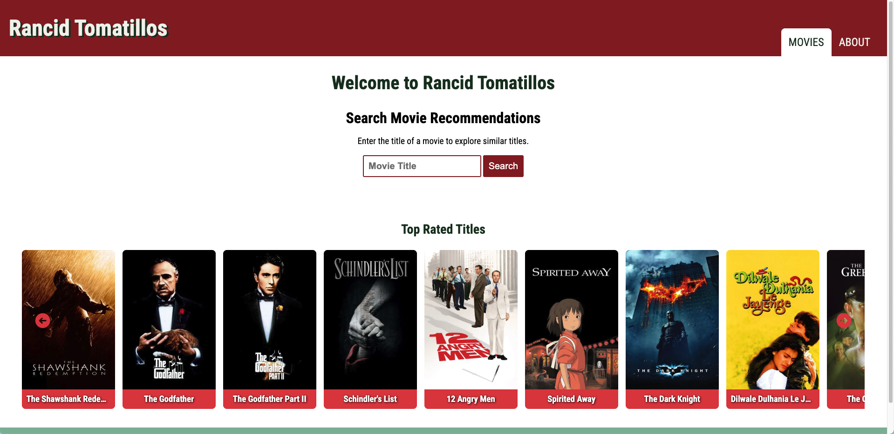

# 🎬 Rancid Tomatillos

This application is a Node.js and Express–based web app that integrates with 
The Movie Database (TMDB) API to help users discover new movies. 
Users can enter the title of a movie they enjoy, and the app will return a 
curated list of similar movies based on TMDB’s recommendation data.

In addition to personalized recommendations, the application also displays a 
selection of top-rated movies, allowing users to browse highly acclaimed titles 
and explore popular films they may have missed. By combining user-driven search with trusted rating data, the app makes finding great movies quick, intuitive, and enjoyable.

The project demonstrates the use of RESTful APIs, server-side routing with Express, 
and dynamic data rendering, making it a practical example of building a 
modern web application with Node.js.

## Features

### 🔍 Movie Search & Discovery
- Search for movies by title using the TMDB Search API.
- Display a list of matching movies with:
  - Poster image
  - Movie title

### 🎥 Similar Movies Recommendation
- Fetch and display movies similar to the selected movie.
- Recommendations update dynamically when a new movie is selected.
- Each recommended movie displays:
  - Poster image
  - Title

### ⭐ Top Rated Movies Carousel
- Display a carousel showcasing top-rated movies from TMDB.
- Horizontal scrolling with button navigation.
- Show movie posters and titles.

### 🔌 API Integration
- Integrates with **The Movie Database (TMDB) API**.
- Uses the following endpoints:
  - Search Movies
  - Similar Movies
  - Top Rated Movies
- Supports API authentication using an API key or bearer token.

### ⚠️ Error & State Handling
- Display loading indicators during API calls.
- Handle empty states:
  - No search results found
  - No similar movies available
- Show user-friendly error messages for network or API issues.

### 💻 User Experience & Interface
- Responsive layout for desktop, tablet, and mobile devices.
- Clean and intuitive UI with clear navigation.
- Visually rich presentation using movie posters and smooth transitions.

### 🔐 Security & Compliance
- Secure handling of TMDB API keys (e.g., environment variables).
- Avoid exposing sensitive keys in client-side code.
- Display required TMDB attribution in accordance with TMDB guidelines.

## 📖 References
- [The Movie Database (TMDB) API Documentation](https://developer.themoviedb.org/reference/intro/getting-started)
